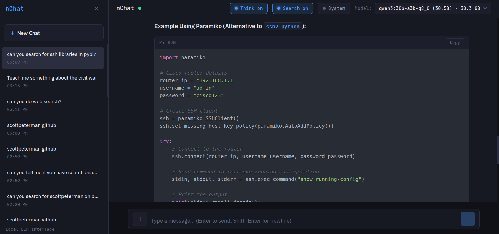
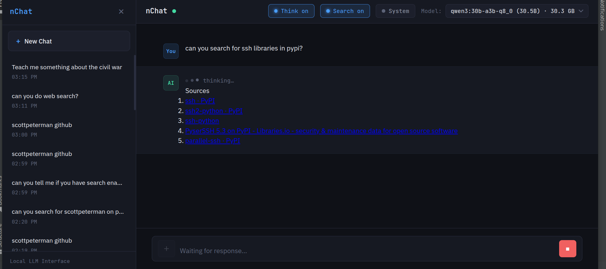
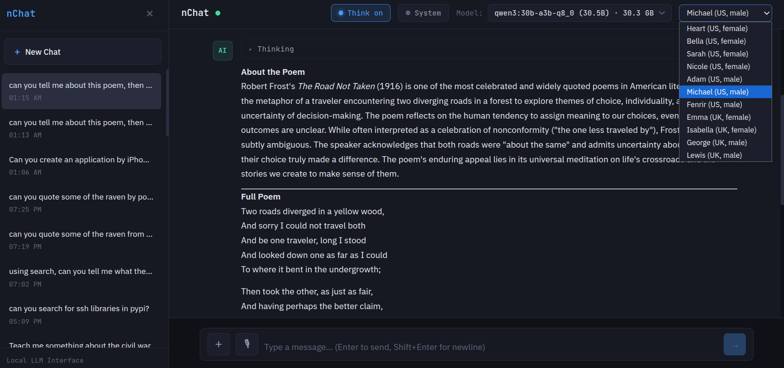
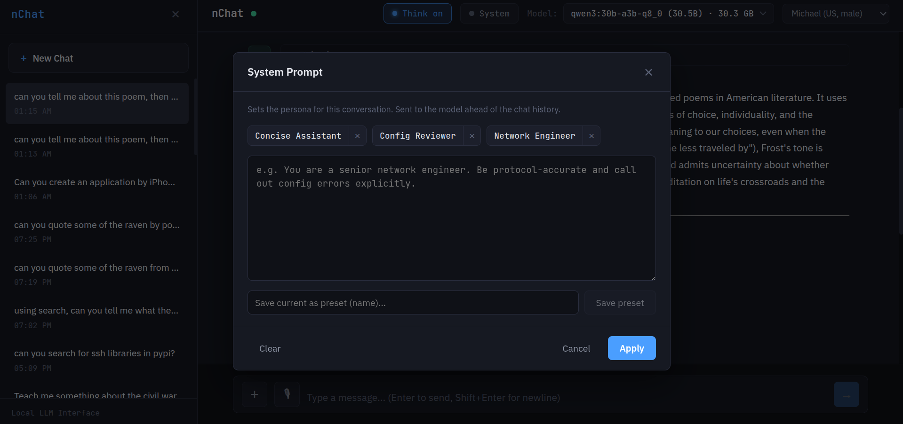

# nChat

A local LLM chat interface powered by [Ollama](https://ollama.ai) — FastAPI backend, React frontend, everything on your own hardware. Streaming chat with optional **web-search grounding** and a fully self-hosted **voice loop** (read-aloud + dictation), with no cloud dependency in either direction.

The stack is deliberately lean and inheritable: FastAPI, SQLite, vanilla React, no exotic dependencies. The two heavyweight ML runtimes (TTS/STT) are an opt-in extra, not a baseline requirement — delete `tts.py`/`stt.py` and their routes and nChat is exactly what it was without them.



*Streaming chat with syntax-highlighted code, reasoning, and web search — all running locally.*

---

## Features

**Core chat**
- Streaming responses over Server-Sent Events, with live token rendering
- Streamed **reasoning display** for thinking-capable models (e.g. qwen3) — toggle "Think" to show or hide the model's reasoning
- Conversation history persisted in SQLite, with auto-titling from the first message
- Model selection from whatever you have pulled in Ollama
- Markdown rendering with syntax-highlighted code blocks; per-block **Copy code** and whole-message **Copy**
- Per-response performance stats (tokens/sec, duration, context size)
- **Automatic context sizing** — `num_ctx` is sized from the actual prompt so attached files and search results aren't silently truncated, with a manual override clamped to a ceiling

**Web search grounding** (optional)
- Toggle "Search" to retrieve live results and inject them into the turn before answering
- Inline numbered citations (`[1]`, `[2]`, …) with a **grounding/abstention contract**: the model is told to ground its answer in the results, cite sources, and say so plainly when the results don't actually answer — rather than laundering guesses under a "searched the web" banner
- Pluggable providers (config swap, not a rewrite): **SearXNG** (local, no key), **Brave** (one key), or **DuckDuckGo** (no setup, POC only)
- Sources render under the answer and persist with the conversation
- Per-turn only: results ground the current answer but aren't re-injected on later turns, so stale snippets don't masquerade as fresh grounding



*Search grounding: live results are retrieved and rendered as numbered, citeable sources under the answer.*

**Voice loop** (optional — see [README_Voice.md](README_Voice.md) and [README_Voice_Loop_Design.md](README_Voice_Loop_Design.md))
- **Read aloud** with Kokoro TTS (11 voices), streamed per-sentence so playback starts on sentence one while the rest synthesizes
- **Dictation** with faster-whisper STT, including networking-aware refinement (a vocab pack plus an optional LLM correction pass) — transcribed text lands in the input for review and never auto-sends
- Fully local: no cloud, no API keys. On Apple Silicon the LLM runs on Metal and the voice models on CPU, so they overlap rather than contend



*The voice loop: pick a Kokoro voice from the top bar and read any response aloud, or dictate prompts with the mic — entirely on local hardware.*

**System prompts**
- Set a per-conversation system prompt / persona, and save reusable **presets**



*Per-conversation personas, with named presets you can save and reuse.*

**File attachments**
- Attach text files to a turn; contents are injected into context and counted by the context budgeter

---

## Prerequisites

- **Python 3.10+**
- **Node.js 18+** (for the frontend build)
- **[Ollama](https://ollama.ai)** running locally with at least one model pulled

```bash
# Install Ollama if needed
curl -fsSL https://ollama.ai/install.sh | sh

# A thinking-capable model gives you the reasoning display; any chat model works
ollama pull qwen3:30b-a3b-q8_0     # or qwen2.5-coder:32b, llama3.1, etc.
```

Optional extras:
- **Voice** — see [Voice setup](#voice) below (installs torch via Kokoro + CTranslate2 via faster-whisper)
- **Web search** — a provider; see [Search setup](#web-search) below

---

## Quick Start

The fastest path — `run.sh` checks Ollama, creates the venv, builds the frontend if needed, and serves everything on one port:

```bash
./run.sh
```

Then open **http://localhost:8400**.

### Manual / development

**Backend:**

```bash
python3 -m venv venv
source venv/bin/activate
pip install -r requirements.txt
uvicorn backend.main:app --host 0.0.0.0 --port 8400 --reload
```

**Frontend (dev server with hot reload):**

```bash
cd frontend
npm install
npm run dev
```

Open **http://localhost:3000** — the Vite dev server proxies API calls to the backend.

### Production build

```bash
cd frontend
npm run build
```

The FastAPI server then serves the built SPA from `frontend/dist/`:

```bash
uvicorn backend.main:app --host 0.0.0.0 --port 8400
```

---

## Configuration

All optional features are off until configured, and degrade cleanly when they aren't. Set these in your shell or add the exports to `run.sh` before the `uvicorn` line so they travel with the project.

### Web search

Search is enabled by selecting a provider. There is no separate on/off flag — **a configured provider is an available provider**, and the in-app "Search" toggle then decides per turn whether to use it. With nothing configured the toggle is a safe no-op: the model is told search was unavailable and answers from its own knowledge, saying so.

| Provider | Setup | Env |
|----------|-------|-----|
| **SearXNG** (recommended — local, no key, query never leaves your box) | Run a container next to Ollama; enable JSON output in its `settings.yml` (`search: { formats: [html, json] }`) | `SEARXNG_URL=http://localhost:8888` |
| **Brave** | One API subscription token, independent index | `BRAVE_API_KEY=...` |
| **DuckDuckGo** | `pip install ddgs` — no key, rate-limited, ToS-grey; fine for a POC, not for shipping | `NCHAT_SEARCH_PROVIDER=ddg` |

```bash
# SearXNG, the local default
docker run -d --name searxng -p 8888:8080 searxng/searxng
export SEARXNG_URL=http://localhost:8888
```

SearXNG and Brave are auto-detected from their env vars; DuckDuckGo must be selected explicitly with `NCHAT_SEARCH_PROVIDER=ddg`. You can also force a choice with `NCHAT_SEARCH_PROVIDER=searxng|brave|ddg`.

### Voice

The voice loop's two ML runtimes are kept out of `requirements.txt` on purpose. Install them only if you want voice:

```bash
pip install -r requirements_voice.txt
```

On Apple Silicon both ship native arm64 wheels (no source builds). Weights download on first use and cache locally. Tuning knobs (all optional):

| Env | Default | Purpose |
|-----|---------|---------|
| `NCHAT_VOICE_WARM` | `0` | Pre-load TTS+STT engines at startup instead of on first use |
| `NCHAT_WHISPER_SIZE` | `small` | Whisper model size (`base.en`/`tiny.en` are faster for English) |
| `NCHAT_WHISPER_BEAM` | — | Beam size for STT decode (`1` = greedy, lowest latency) |
| `NCHAT_WHISPER_VAD` | on | Voice-activity-detection filter |
| `NCHAT_REFINE_MODEL` | — | Ollama model for the optional LLM dictation-refinement pass (use a fast MoE) |
| `NCHAT_TTS_CACHE` | `0` | Opt-in disk cache for replayed read-alouds |
| `NCHAT_TTS_CACHE_MAX` | `128` | LRU bound (entry count) for the TTS cache |

`run_simple.sh` is a low-latency voice preset (`NCHAT_VOICE_WARM=1 NCHAT_WHISPER_SIZE=base.en NCHAT_WHISPER_BEAM=1`). See [README_Voice_Loop_Design.md](README_Voice_Loop_Design.md) for the full latency/placement reasoning and validation status.

---

## API Endpoints

| Method | Endpoint | Description |
|--------|----------|-------------|
| GET | `/api/health` | Health check + Ollama status |
| GET | `/api/models` | List available Ollama models |
| POST | `/api/chat` | Stream a chat response (SSE). Body supports `think`, `web_search`, `search_results`, `file_ids`, `num_ctx` |
| POST | `/api/upload` | Upload a text file to attach to a turn |
| GET | `/api/conversations` | List conversations |
| POST | `/api/conversations` | Create a conversation |
| GET | `/api/conversations/{id}` | Get a conversation |
| PUT | `/api/conversations/{id}` | Update a conversation |
| DELETE | `/api/conversations/{id}` | Delete a conversation |
| GET | `/api/conversations/{id}/messages` | Get messages for a conversation |
| GET | `/api/prompts` | List saved system-prompt presets |
| POST | `/api/prompts` | Create a preset |
| DELETE | `/api/prompts/{id}` | Delete a preset |
| GET | `/api/tts/voices` | List TTS voices (served even without the engine) |
| POST | `/api/tts` | Synthesize a message → `audio/wav` |
| POST | `/api/tts/stream` | Synthesize as per-sentence WAV frames (low time-to-first-audio) |
| POST | `/api/stt` | Transcribe an audio clip → `{raw, text, timings}` |

The `/api/chat` SSE stream emits typed events: `meta` (conversation id + chosen context size), `search` (sources + notice, when search ran), `thinking` (reasoning tokens), `token` (answer tokens), `done` (stats), and `error`.

---

## Architecture

```
nchat/
├── backend/
│   ├── main.py            # FastAPI app: Ollama proxy, SSE chat, voice + search wiring
│   ├── database.py        # SQLite persistence (conversations, messages, presets)
│   ├── search.py          # Web-search providers (SearXNG/Brave/DDG) + grounding contract
│   ├── tts.py             # Kokoro TTS engine, markdown→speech, per-sentence streaming
│   ├── stt.py             # faster-whisper STT, networking-aware refinement
│   ├── try_ddg.py         # standalone DuckDuckGo provider smoke test
│   └── voice_selftest.py  # fixture gate for the voice modules (no engine needed)
├── frontend/
│   ├── src/
│   │   ├── App.jsx                  # App state, streaming, search + voice settings
│   │   ├── voice.js                 # Browser playback controller + mic capture
│   │   ├── components/
│   │   │   ├── ChatView.jsx         # Message list, input, mic button
│   │   │   ├── MessageBubble.jsx    # Markdown, code, Read button, sources footer
│   │   │   ├── ModelSelector.jsx    # Model dropdown
│   │   │   ├── Sidebar.jsx          # Conversation history
│   │   │   └── SystemPromptModal.jsx# System prompt + presets
│   │   └── styles/app.css           # Dark theme
│   ├── package.json
│   └── vite.config.js
├── requirements.txt          # core deps (lean)
├── requirements_voice.txt    # optional voice deps (torch, CTranslate2, soundfile)
├── run.sh                    # one-command start
├── run_simple.sh             # low-latency voice preset
├── snapshot.sh               # coherent project archiver (excludes deps/build/DB)
├── README_Voice.md           # voice user guide
└── README_Voice_Loop_Design.md  # voice design + validation
```

---

## Design notes

- **Local-first, no cloud.** Chat runs against your Ollama; SearXNG keeps search queries on your network; the voice loop runs entirely on local hardware. No keys are required unless you choose Brave.
- **Grounding contract.** Search applies a PRESENT/ABSENT/UNREACHABLE discipline: cite what the sources support, abstain explicitly when they don't, and never imply a search happened when it didn't.
- **Degrade, never fail.** Voice and search are guarded — the app boots without their dependencies, the voices catalog serves even with no engine, and missing capabilities return clean 503s or visible no-ops rather than crashing the chat spine.
- **Context-safe injection.** Files and search results are injected before the context budget is computed, so `num_ctx` grows to fit them instead of letting Ollama silently truncate.
- **Inheritable stack.** FastAPI + SQLite + vanilla React, GPL-licensed. The one honest exception is the optional voice runtime, which is firewalled behind its own requirements file and guarded imports.

---

## License

GPLv3