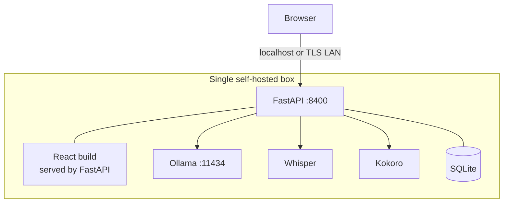

# nChat Voice Loop — Design

**Status:** built and validated on Apple Silicon. Both directions near-instant —
dictation lands in well under a second; read-aloud starts speaking on the first
sentence while the rest synthesizes.
**Scope:** local text-to-speech (response reading) and local speech-to-text
(prompt dictation) in nChat, with zero cloud dependency.
**Spine:** nChat — FastAPI backend, Ollama inference, React frontend, SQLite
persistence.
**Added engines:** Kokoro (TTS) and faster-whisper (STT), both running on the same
box as Ollama.

---

## 1. Purpose

nChat is a typed loop: you type a prompt, Ollama answers, you read the answer.
This closes a **voice loop** around that same spine — speak the prompt, hear the
answer — without any part of it leaving the machine. Audio is captured in the
browser, transcribed locally by Whisper, refined locally, answered locally by
Ollama, and spoken back locally by Kokoro. No audio, no transcript, and no
generated text ever crosses a network boundary you don't own.

The two halves are independent and individually useful. TTS alone gives you a
"read this aloud" button; STT alone gives you hands-light dictation into the input
box. Together they form the loop. They are two features sharing one infrastructure
pattern, not a monolith.

## 2. Design tenets

The constraints the rest of the document is accountable to.

- **Self-hosted, full stop.** Every model runs on local hardware. The privacy
  property — audio never leaves the box — is a first-class feature, not a side
  effect.
- **The spine is unchanged.** nChat's request/response shape, SQLite schema, and
  SSE streaming are not rewritten. The voice features bolt on through new
  endpoints and two new backend modules. Delete `tts.py` and `stt.py` and their
  routes and nChat is exactly what it is without them — the app boots and the full
  chat path works with the voice modules and runtimes entirely absent.
- **Inheritable stack, honest about the exception.** The codebase stays PyQt-free,
  pip-installable, no exotic services. The one genuine cost is two heavyweight ML
  runtimes (torch via Kokoro, CTranslate2 via Whisper); these are named, budgeted,
  and quarantined into `requirements-voice.txt` rather than hidden.
- **Review before send, review before trust.** STT drops text into the textarea;
  it does not auto-send. Even refined transcription earns a human glance before it
  becomes a conversation turn.
- **Degrade, never fail.** A missing model, an out-of-VRAM GPU, an unsupported
  browser, or a refine timeout falls back to a lesser-but-working path (CPU,
  regex, the blob audio path, raw transcript) rather than erroring. The loop
  closes even when a link is degraded; a missing engine surfaces a clear 503 and
  an inline message on the button, and the rest of nChat keeps working.
- **Audio is ephemeral.** Transcripts and responses persist as text in SQLite,
  exactly as today. Raw audio is processed and discarded. The only audio that may
  persist is an optional, off-by-default TTS cache, keyed and disposable.

## 3. System overview

The voice loop wraps the typed loop. The new work happens at the two ends —
capture and playback in the browser, transcription and synthesis on the backend —
while the middle (Ollama generation) is untouched.

```mermaid
sequenceDiagram
    participant U as User
    participant B as Browser (React)
    participant API as FastAPI
    participant W as Whisper (local)
    participant O as Ollama (local)
    participant K as Kokoro (local)

    U->>B: click mic, speak, click again
    B->>API: POST /api/stt (webm/opus blob)
    API->>W: transcribe (threadpool)
    W-->>API: raw text
    API->>API: refine (regex | small-LLM)
    API-->>B: {raw, text, timings}
    B->>U: text in textarea (review)
    U->>B: edit if needed, send
    B->>API: POST /api/chat (existing SSE path)
    API->>O: stream generation
    O-->>B: tokens (SSE)
    B->>U: rendered response
    U->>B: click "Read"
    B->>API: POST /api/tts/stream (markdown)
    API->>API: markdown -> speakable
    loop per sentence
        API->>K: synthesize next sentence (threadpool)
        K-->>API: WAV chunk
        API-->>B: length-prefixed WAV frame
        B->>U: decode + schedule; playback continues gaplessly
    end
```

The loop is **naturally sequential**. STT finishes before Ollama starts; Ollama
finishes before TTS starts (the Read button appears only once generation is
`done`). That ordering, plus the user's own turn-taking, is what makes three
models on one machine tractable — they rarely contend.

## 4. Component architecture

### 4.1 Backend modules

Two modules, each a thin wrapper over an engine plus the domain logic that makes
it useful for *this* context.

`tts.py` — Kokoro wrapper. Caches one `KPipeline` per language code (load is
expensive; hold it resident, the same instinct as Ollama's `keep_alive`). Two
value-adds beyond a raw Kokoro call:

- `markdown_to_speech()` — chat output is Markdown, and read raw a TTS engine
  narrates backticks and spells out code blocks. The cleaner strips to prose and,
  by default, *announces* code rather than reading it (a fenced block becomes e.g.
  `(Code block in bash, 2 lines.)`). It also flattens links to their text, drops
  headers and emphasis markers, and reduces tables to spoken prose.
- `synth_stream()` — Kokoro's pipeline yields audio per sentence as it
  synthesizes, so rather than concatenate the whole answer into one WAV, this
  encodes and emits each sentence immediately as a length-prefixed frame. This is
  what makes read-aloud start almost instantly (§6).

`synthesize()` (the non-streaming, whole-WAV path) remains as the fallback and the
cacheable form. The cleaner and the voice catalog are stdlib-only and provable
without the engine present.

`stt.py` — faster-whisper wrapper. Caches one `WhisperModel`. Its value-add is the
refinement stage: a regex pass that converts spoken punctuation ("comma", "new
paragraph") to marks at zero latency and repairs the ways Whisper mangles protocol
names ("oh SPF" → OSPF, "M T U" → MTU), plus an optional local-LLM pass running
the same correction against the Ollama server already in front of nChat. Decode is
tuned for low latency on reviewed dictation: configurable model size, greedy
decode by default (`beam_size=1`), VAD silence-trimming, and
`condition_on_previous_text=False` (each clip stands alone, which also avoids
short-clip hallucination loops). See §6 for the latency levers.

Both modules cache the model once, dispatch blocking inference to a thread, take
bytes in and return bytes-or-text out. The heavy engine import (torch /
CTranslate2) is **lazy, inside the module**, so importing either module is cheap
and never requires the runtimes — the basis of the boots-without-voice guarantee.
Both expose `warm()` for the opt-in startup pre-load, and `warm()` exercises the
*full* path (model load **and** the VAD model / first-inference graph setup) so
the user's first action never pays a hidden cold cost.

### 4.2 Endpoints

| Method | Path | Body | Returns | Notes |
|--------|------|------|---------|-------|
| POST | `/api/tts/stream` | `{text, voice, speed, read_code}` | length-prefixed WAV stream | per-sentence chunks; near-instant first audio |
| POST | `/api/tts` | `{text, voice, speed, read_code}` | `audio/wav` | whole-WAV; the fallback + cacheable form |
| GET | `/api/tts/voices` | — | `{voices: [...]}` | populates the dropdown; served even without the engine |
| POST | `/api/stt` | multipart: `file`, `refine` | `{raw, text, timings}` | webm/opus blob; `timings` reports per-stage ms |

`/api/chat`, `/api/upload`, and the conversation/prompt routes are unchanged. The
voice routes are registered before the SPA catch-all so they aren't shadowed.
`refine` is one of `regex` (default), `ollama`, or `none`.

The streaming wire format is `[4-byte big-endian length N][N bytes: a
self-contained WAV]`, repeated — one frame per sentence. The endpoint loads the
Kokoro pipeline *before* opening the response, so an absent engine is a clean 503
rather than a half-open stream.

### 4.3 Frontend

The browser-side plumbing lives in one module, `frontend/src/voice.js`, which owns
playback (one message reads at a time), `MediaRecorder` capture, and a small
pub/sub. Using pub/sub rather than props means a Read button reflects its own
loading/playing state without re-rendering — `MessageBubble` stays memoized.

Playback has two paths under one controller and one "only one at a time" rule:

- **Streaming (default).** The client reads `/api/tts/stream`, parses the
  length-prefixed WAV frames as bytes arrive, decodes each with `decodeAudioData`,
  and schedules the resulting buffers back-to-back on a single Web Audio
  `AudioContext` timeline (`nextStart = startAt + buffer.duration`). Sentence one
  plays while sentence two is still synthesizing server-side; as long as synthesis
  stays ahead of playback — which it does on Apple Silicon — it's gapless. The
  Read click is the user gesture that resumes the `AudioContext`.
- **Blob (fallback).** If the browser lacks Web Audio, or streaming errors *before
  any audio plays*, the controller falls through to `/api/tts` and plays the
  single returned WAV via one `Audio()` element. Once audio has started, an error
  just stops cleanly. An undecodable streamed chunk is skipped, not fatal.

`Stop`, the one-at-a-time rule, and the per-button state work identically across
both paths; the controller's teardown aborts the in-flight stream, stops scheduled
buffer sources, and revokes any blob URL.

A `ReadButton` (plus a whole-message Copy) sits in the assistant message action
row, shown only once the message is finished (`!streaming && content`). A
`MicButton` sits beside the attach button: click to start, click to stop; it
captures via `getUserMedia` + `MediaRecorder`, POSTs to `/api/stt`, and appends
the returned text into the existing `input` state without submitting. A voice
`<select>` in the top bar is populated from `/api/tts/voices` (11 voices) and
drives the controller's current voice. The STT response's `timings` are logged to
the console for tuning.

## 5. The inference plane (the crux)

> **Target hardware: Apple Silicon Mac (M-series, unified memory).** Validated on
> exactly this. The discrete-CUDA case is a portability note at the end.

Three models share the machine: the Ollama chat model (large), Whisper (small),
and Kokoro (small). On Apple Silicon the framing is not "does it fit in VRAM" but
"how do they split across **unified memory** and across **different compute
units**."

### 5.1 Unified-memory budget (measured)

There is no separate VRAM pool. Ollama (on Metal), Whisper, and Kokoro all draw
from the same system RAM, so the question is total memory:

| Tenant | RAM | Notes |
|--------|-----|-------|
| Ollama `qwen3:30b-a3b-q8_0` | **30.3 GB resident** (measured) | the dominant tenant; MoE, ~3B active; runs at ~86 tok/s |
| Whisper (int8, CPU) | ~0.3–0.8 GB | size-dependent; `small` is the upper end |
| Kokoro (82M, CPU) | ~0.3 GB | 24 kHz output |
| **Added by voice** | **~1 GB** | rounding error against the LLM |

The voice models cost about a gigabyte on top of the chat model. The real
constraint is simply that the chat model fits your machine's RAM with room to
spare — which, running the 30B at q8 at 30.3 GB, it does. Adding voice doesn't
change that math, and coresidency confirmed it directly (§13).

### 5.2 Placement decision (settled and proven)

One line on Apple Silicon: **chat model on Metal, voice models on CPU.** This is
better than a discrete-GPU box, not a compromise — on a single GPU the LLM,
Whisper, and Kokoro would fight for one device; here the LLM runs on the
**GPU/Metal cores** while the voice models run on the **CPU cores** (different
silicon), so they genuinely overlap. Both directions fire while the 30B is
resident with no contention felt.

- **Whisper on CPU:** at int8, transcription is fast enough for review-before-send
  — sub-second with the recommended size/beam settings (§6).
- **Kokoro on CPU:** at 82M, synthesis runs faster than real time on M-series, so
  per-sentence streaming stays comfortably ahead of playback.
- **MPS/Metal for the voice models:** possible but unnecessary — CPU is fast
  enough and avoids contending with Ollama on the Metal cores. Optional tinkering.

`stt.py` and `tts.py` default `device="auto"`; on a Mac with no CUDA that resolves
to CPU for the voice models, which is exactly right.

### 5.3 Concurrency

FastAPI is async; blocking model calls go through `asyncio.to_thread`, and the
streaming TTS generator is iterated in a threadpool by Starlette so each sentence
flushes as it finishes. CTranslate2 (Whisper) and torch (Kokoro) release the GIL
during compute, so the threadpool overlaps real work. Because the voice models are
on CPU and the LLM is on Metal, a voice call near an Ollama call is on a
*different unit* — worst case is memory-bandwidth contention, not a serialized
queue. For a single-user home tool this is a non-issue regardless, since the loop
is sequential by construction (§3). Model-load paths are lock-guarded against
double-loading on concurrent cold hits.

### 5.4 Portability note (discrete CUDA box)

On a Linux/CUDA box all three models compete for one GPU's VRAM. The rule there is
*LLM on GPU, voice models on CPU when VRAM is contended* — Whisper on CPU is
cheap; Kokoro on CPU is slower than real time on x86, where per-sentence streaming
TTS (§6) matters even more as the mitigation. The `device="auto"` → CPU-on-OOM
fallback in `stt.py` keeps a contended CUDA box degrading rather than crashing.

## 6. Latency budget and levers

End-to-end, warm models, single user, Apple Silicon (LLM on Metal, voice on CPU).

| Stage | Cost | Lever |
|-------|------|-------|
| Capture | user-controlled | — |
| Upload (localhost) | negligible | — |
| STT decode (CPU) | sub-second, tuned | model size, beam, VAD, warm |
| Refine (regex) | ~0 ms | default |
| Refine (local LLM) | ~0.5–1.5 s | reuse `qwen3:30b-a3b` (MoE, fast) |
| Ollama TTFT (warm) | ~0.3–1 s | `keep_alive` (set) |
| Generation | length × tok/s | measured ~86 tok/s |
| **TTS time-to-first-audio** | **near-instant (~first sentence)** | per-sentence streaming (default) |

### STT levers

Speech-to-text is the latency the user feels most — it's a dead wall: you stop
talking and wait, staring at an empty box, before anything else can happen. Four
levers, in order of impact:

- **Warm the full path** (`NCHAT_VOICE_WARM=1`). The biggest first-clip cost is
  cold load — and not just the Whisper model: VAD lazily loads a *separate* Silero
  model on the first real transcribe. `warm()` runs a throwaway decode so both
  load up front, and the user's first dictation is no longer the slow one.
- **Model size** (`NCHAT_WHISPER_SIZE`). The biggest steady-state lever. `base.en`
  is faster *and* more accurate than `small` for English; `tiny.en` is fastest.
  English-only `.en` variants beat the multilingual models for this use.
- **Greedy decode** (`NCHAT_WHISPER_BEAM=1`, the default). ~1.5–2× faster than the
  library default beam width of 5, with a minor accuracy cost that
  review-before-send absorbs.
- **VAD** (`NCHAT_WHISPER_VAD=1`, on). Trims silence before decode — faster and
  more accurate on clips with dead air at the ends.

The recommended low-latency configuration is `NCHAT_VOICE_WARM=1
NCHAT_WHISPER_SIZE=base.en NCHAT_WHISPER_BEAM=1`, which takes steady-state
transcription well under a second. The `/api/stt` response includes per-stage
`timings` (`transcribe_ms`, `refine_ms`, `audio_kb`) so this is tuned with data,
not vibes — the first call after a cold start carries model+VAD load in
`transcribe_ms`, and the delta to steady state tells you whether to warm.

### TTS lever

Kokoro is a single 82M model — there's no smaller-faster variant to swap to, so
the STT model-size lever has no TTS equivalent. The equivalent win is **streaming**
(§4.1): synthesize and play sentence by sentence instead of waiting for the whole
answer. Because Kokoro is faster than real time on CPU and the pipeline yields per
sentence, time-to-first-audio collapses from "the whole answer" to "the first
sentence" — effectively instant even on a long, multi-section response. `warm()`
absorbs the cold first-inference cost on top of that.

## 7. Data flow, contracts, persistence

What persists is exactly what persists today: user and assistant **text** in
SQLite, attached files as text. The voice layer adds nothing to the schema.

Audio is ephemeral. STT writes the uploaded clip to a temp file only long enough
for Whisper to decode it (PyAV handles webm/opus), then deletes it in a `finally`.
TTS holds WAV bytes in memory just long enough to return or stream them.

The one optional persistence is the **TTS cache**, off by default
(`NCHAT_TTS_CACHE=1` to enable): key on `hash(speakable_text + voice + speed +
read_code)`, store the WAV on disk, serve instant replays. Bounded LRU by entry
count (`NCHAT_TTS_CACHE_MAX`, default 128), safe to wipe. The cache applies to the
whole-WAV path (`/api/tts`); the streaming path bypasses it, since low
time-to-first-audio is already the point and there's nothing to cache mid-stream.
Keying on the *speakable* text (post-strip) means cosmetic Markdown edits that
strip to the same prose still hit cache.

## 8. STT refinement strategy

Refinement has three modes, defaulting to the honest one:

- **`regex` (default):** spoken-punctuation cleanup, networking-vocab fixups,
  dictated-hyphen attachment — zero latency, no second model. The daily driver.
- **`ollama`:** the networking correction prompt run against a fast local model
  (the MoE), for gnarly dictation. Degrades to `regex` on any failure.
- **`none`:** raw Whisper, for when you want to see exactly what it heard.

The domain is fixed (networking), so the prompt and vocab are baked in rather than
selected.

The vocabulary pack is the durable asset, and it's a **single source of truth**.
Whisper emits acronyms two ways — joined ("mtu") and as spaced single letters ("m
t u") — so rather than hand-maintain parallel lists, one `_ACRONYMS` map generates
the spaced-letter regex for each entry. Adding a term fixes both forms at once, and
the same map feeds the LLM prompt's vocab hint. Irregulars that don't follow the
rule (the "oh"/"o" homophone for OSPF, mixed-case iBGP/eBGP, hyphenated IS-IS /
NX-OS) are handled explicitly first. Dictated hyphens attach to their neighbors
("core dash one" → `core-one`), a deliberate bias for a network engineer who
dictates interface and device names constantly, safe under review-before-send.
This inversion — *one canonical fact, both representations derived from it* — is
the same "output selects template" instinct as tfsm-fire, and is the part most
worth lifting into other dictation contexts verbatim.

## 9. Deployment topology



**Default: single node.** Everything on the box with the GPU. The browser runs on
that box (localhost) or reaches it over the LAN.

**The `getUserMedia` constraint.** Microphone capture requires a secure context.
`localhost` qualifies — the browser prompts for mic permission on first use — a
plain-HTTP LAN IP does not. Three ways through it, in order of preference:

1. Run the browser on the same box — localhost, nothing to configure (the
   validated path).
2. Put a TLS reverse proxy in front (Caddy with a local CA, or a self-signed cert)
   for LAN access — the right answer for using nChat from a laptop against a GPU
   desktop; pair with a bearer token, the streamable-HTTP pattern mcpssh uses.
3. Browser origin flags — works, but per-browser and brittle; avoid.

**Scale path: split nodes.** If the GPU box isn't where you want the app, the app
node can talk to an inference node over HTTP. The cost is an audio-bytes hop over
the LAN, reintroducing a boundary the single-node design avoids. Not needed for
home use; noted as the seam if it ever is.

## 10. Security and privacy

Self-hosting *is* the security model here.

- **No cloud surface.** Audio, transcript, prompt, and response stay on hardware
  you control. No third-party voice service, no API key for the loop, no
  telemetry.
- **Bind local by default.** The voice endpoints inherit nChat's binding. For
  localhost-only use, no auth is needed. The moment it's LAN-exposed, the TLS
  reverse proxy (§9) should carry a bearer token in front of the API.
- **No new persisted PII.** Audio is ephemeral and only text persists (as it
  already does), so the voice layer doesn't widen the data-at-rest footprint. The
  optional cache holds synthesized speech of already-stored text — it leaks
  nothing the database doesn't already hold.

## 11. Failure modes and degradation

Every link has a defined fallback so the loop closes even when degraded.

- **Voice runtime / weights missing:** the module imports fine (lazy engine
  import); the first synth/transcribe surfaces a clear 503 and an inline message
  on the button, while the rest of nChat works. First real use downloads the
  weights.
- **Streaming unsupported or errs before audio:** playback falls through to the
  whole-WAV `/api/tts` path; an undecodable streamed chunk is skipped, not fatal.
- **GPU OOM or no CUDA:** `stt.py` retries on CPU automatically; Kokoro is placed
  on CPU per §5.2.
- **Ollama down during refine:** `ollama` mode catches and degrades to `regex`,
  never losing the transcript.
- **Container won't decode:** rare with PyAV; documented fallback is a one-line
  ffmpeg transcode to 16 kHz mono WAV.
- **TTS on a code-only answer:** `markdown_to_speech` yields empty, so a short
  silence WAV is returned rather than zero-length audio.

## 12. Dependency and licensing reality

The cost: two heavyweight ML runtimes — **torch** (via Kokoro) and **CTranslate2**
(via Whisper) — quarantined in `requirements-voice.txt`, separate from the lean
core. A conscious, budgeted "yes," not a surprise. On Apple Silicon both ship
native arm64 wheels, so installation is `pip install` clean, no source builds.

The clean parts: Kokoro and its G2P are Apache-2.0; faster-whisper and the Whisper
weights are MIT. The refinement prompts and vocab packs are original work. The
Whisper-wrapper and refinement code derive from velocidictate, whose GPLv3 came
from **PyQt6** — which nChat does not use — so the non-Qt parts (the Whisper
wrapper, the prompts, the vocab) shed the GPL trigger, and the voice backend stays
MIT-clean alongside nChat. espeak-ng (an optional Kokoro fallback) is GPLv3 but a
separate runtime binary invoked as its own process — no license bleed, and not
required for normal use.

## 13. Validation status

Proven, in the spirit of the UglyFruit transition checklist — fixture-proven
first, then wired, then validated under real load.

- **Modules in isolation.** The fixture gate (`python -m backend.voice_selftest`)
  covers the `markdown_to_speech` cleaner, the regex refiner and vocab pack, and
  the streaming frame format, with no engine and no nChat. `python -m backend.tts`
  and `python -m backend.stt` are the per-module harnesses.
- **Degrade, never fail.** App boots with no torch/CTranslate2; the voices
  endpoint serves the catalog regardless; TTS/STT return clean 503s; the spine is
  untouched and the voice routes aren't shadowed by the SPA catch-all.
- **TTS, localhost.** Responses read aloud with code blocks announced, not
  narrated; streaming starts speaking on the first sentence; the Read button
  appears only after generation completes.
- **STT, localhost.** Mic dictation captures on localhost (secure-context prompt
  and all), transcribes sub-second with the recommended settings, and lands
  refined text in the textarea without auto-sending.
- **Coresidency under real models.** The 30B MoE (30.3 GB), Whisper, and Kokoro
  run together; the full loop closes both directions with no contention felt — the
  live-gear gate, watching memory pressure rather than VRAM OOM. Both directions
  are near-instant in steady use.

## 14. Open decisions

- **Voice-model placement** — *settled:* CPU for Whisper and Kokoro, Metal for the
  LLM (§5.2). MPS for the voice models stays available as optional tinkering.
- **TTS delivery** — *settled:* per-sentence streaming is the default; the
  whole-WAV path is the fallback and the cacheable form.
- **Default refine mode** — *settled:* `regex` is the default; `ollama` (on the
  MoE) is available per request. A per-dictation UI toggle is still open.
- **STT defaults** — *settled and tunable:* greedy decode and VAD on by default;
  model size, beam, VAD, and warm are environment knobs (§6, Appendix A). The
  recommended low-latency combo is documented; the shipped default model is
  `small` (no forced re-download), with `base.en` recommended for speed.
- **Auto-read vs button** — *settled:* button-triggered is the default; auto-read
  is a future setting, not a default, because it spends CPU on every turn.
- **TTS cache** — *settled:* off by default, opt-in via `NCHAT_TTS_CACHE=1`,
  bounded and disposable (§7); applies to the whole-WAV path only.
- **Startup warm** — *settled:* lazy by default, opt-in via `NCHAT_VOICE_WARM=1`,
  warming the full decode path.
- **Speed / read-code controls** — *remaining:* both wired through the backend; UI
  surfacing is a few lines when wanted.
- **Voice and speed persistence** — *remaining:* currently a global selection in
  the top bar; per-conversation persistence in SQLite is the open call.
- **LAN exposure** — *remaining:* localhost-only on the Mac (simplest, most
  private, validated) or TLS-fronted LAN access (needed to use it from another
  machine, which the mic's secure-context rule requires).

## 15. Future direction — hands-free mode

The current loop is **push-to-talk and push-to-read**: you click the mic, you
click Read. A full hands-free mode would close the loop without touch — listen
continuously, send on a natural pause, speak the answer, and return to listening.
The pieces are mostly in place; what's missing is orchestration and one honest
tension to resolve.

What it would take:

- **Continuous, VAD-gated capture.** Instead of click-to-start/stop, run the mic
  continuously and use voice-activity detection to find utterance boundaries —
  start an utterance on speech onset, end it on a configurable trailing silence
  (e.g. ~800 ms). The Silero VAD already in the STT path is the natural basis; the
  work is moving the boundary decision client-side (or streaming audio to a
  server-side VAD) so capture is hands-free.
- **Auto-send on end-of-utterance.** When silence closes an utterance, transcribe,
  refine, and submit — no Send click.
- **Auto-read the response.** Reuse the streaming TTS path to speak the answer as
  it generates, then return to listening. A barge-in rule (new speech detected →
  stop reading, capture the interruption) makes it conversational rather than
  walkie-talkie.
- **A single mode control.** One toggle (or a wake phrase) to enter/leave
  hands-free, plus a clear listening / ▶ speaking / ⏸ indicator, since without
  buttons the user needs to *see* what the loop is doing.

The honest tension: hands-free relaxes the **review-before-send** tenet (§2).
Auto-send means dictation becomes a turn without a human glance, which is exactly
what that tenet guards against — appropriate for casual conversation, riskier when
dictation drives anything consequential. The resolution is to make hands-free an
explicit, off-by-default mode the user opts into for a session, not a new global
default — the same posture as warm and the cache. Push-to-talk stays the safe
baseline; hands-free is the deliberate, bounded exception you turn on.

This is a real build (continuous capture, VAD boundary logic, barge-in, mode UI),
not a knob — noted here as the next natural direction now that both halves of the
loop are fast enough to make a no-touch conversation feel responsive.

## Appendix A — Configuration surface

| Variable | Default | Effect |
|----------|---------|--------|
| `NCHAT_VOICE_WARM` | `0` | `1` pre-loads both engines (full decode path) at startup. |
| `NCHAT_WHISPER_SIZE` | `small` | faster-whisper model. `base.en` recommended for speed; `tiny.en` fastest. |
| `NCHAT_WHISPER_BEAM` | `1` | decode beam width; `1` = greedy (fastest). |
| `NCHAT_WHISPER_VAD` | `1` | `1` trims silence before decode. |
| `NCHAT_REFINE_MODEL` | `qwen3:30b-a3b` | Ollama model for `ollama`-mode refinement (fast, not dense-large). |
| `NCHAT_TTS_CACHE` | `0` | `1` enables the bounded on-disk TTS cache (whole-WAV path). |
| `NCHAT_TTS_CACHE_MAX` | `128` | LRU bound (entry count) for the TTS cache. |

Recommended low-latency STT: `NCHAT_VOICE_WARM=1 NCHAT_WHISPER_SIZE=base.en
NCHAT_WHISPER_BEAM=1`.

## Appendix B — File manifest

New: `backend/tts.py` (`markdown_to_speech`, `synthesize`, `synth_stream`, voice
catalog), `backend/stt.py` (Whisper wrapper, regex/LLM refine, vocab pack),
`backend/voice_selftest.py` (fixture gate), `frontend/src/voice.js` (streaming +
blob playback, STT capture), `requirements-voice.txt`, `VOICE.md`.
Modified: `backend/main.py` (guarded imports, voice config + knobs, opt-in warm,
the TTS/STT/stream/voices routes, STT timings), `frontend/src/App.jsx` (voice
catalog + selector), `ChatView.jsx` (mic), `MessageBubble.jsx` (Read + message
Copy), `styles/app.css`, `README.md`.
Untouched spine: `/api/chat`, `database.py`, the SQLite schema, SSE streaming.

---

*The voice loop adds local TTS and STT to nChat without disturbing its spine,
keeps every model on local hardware, and is honest about the one real cost — two
heavyweight ML runtimes alongside the LLM. On Apple Silicon the placement is
settled (LLM on Metal, voice on CPU, one unified-memory pool), and both directions
are near-instant in real use: dictation lands sub-second, and read-aloud starts
speaking on the first sentence while the rest synthesizes.*